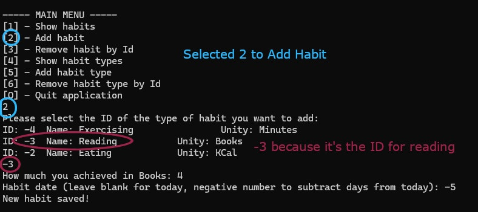

# Habit Tracker in C#

This is a program that tracks the occurrencies of habits and offer insights such as average and counting of occurrence and filter by date. The data is saved in a local MySQL database to offer persitence.

## Notes on Usage

You can add habits but, for that, you need to have HabitTypes registered. For instance, if you want to track how much you are running in Km, you need to register a habit type of Running with unity of Km. After that you can add habits of type Km.

The screenshots below shows an example.

When running the project for the first time, a sample database will be created with 100 random habit records, also, 4 habit types come by default: _Reading_, _Running_, _Exercising_ and _Eating_, more can be added in the menu.

_Obs_: dates can be written more easily by either typing nothing (defaults to today) or a negative number (defaults to `today - number`). Thit is easier to write than a date in the format `dd/mm/yyyy`.

## Running the Project

In Visual Studio: clone the repository and run.

On terminal/VS Code: clone the repository and type `dotnet run` (untested).
